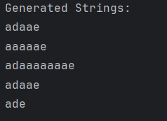
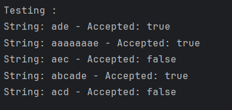

# Finite Automata and Regular Grammars

## Course: Formal Languages & Finite Automata

### Author: Cobzari Ion Group FAF-233

## Theory

Formal languages provide a framework for understanding how languages, in the broadest sense, are structured and processed. At its core, a formal language is defined by an alphabet, which is a finite set of symbols, and a set of strings formed from these symbols that are considered valid according to specific rules, known as the grammar of the language. Regular grammars, a subset of formal grammars, restrict the form of production rules and are powerful enough to describe numerous natural and artificial languages, though they cannot capture the complexities of all languages.

A grammar G is typically defined as a tuple G = (V_N, V_T, P, S), where:

- V_N is a finite set of non-terminal symbols.
- V_T is a finite set of terminal symbols.
- P is a finite set of production rules, each rule transforming a string of symbols into another string.
- S is the start symbol, a special non-terminal symbol from V_n used to begin the generation of strings.

A regular grammar is a type of formal grammar that generates regular languages, which are a subset of the class of formal languages. They can be of two types: right-linear grammars and left-linear grammars. A right-linear grammar has production rules of the form A → aB or A → a, where A and B are non-terminal symbols, a is a terminal symbol, and → denotes the transformation. A left-linear grammar has production rules of the form A → Ba or A → a, with the same symbols and transformation notation.

Regular languages can be recognized by finite automata, which are abstract machines that process input strings symbol by symbol and can produce outputs based on a set of internal states and transition rules.

A finite automaton FA can be defined as a tuple FA = (Q, Σ, δ, q_0, F), where:

- Q is a finite set of states.
- Σ is a finite set of input symbols (alphabet).
- δ is the transition function δ: Q × Σ → Q, defining the transitions between states based on input symbols.
- q_0 is the initial state, an element of Q.
- F is the set of accept states, a subset of Q.

The process of converting a grammar into a finite automaton involves translating the components of the grammar (non-terminal and terminal symbols, production rules, and the start symbol) into the components of a finite automaton (states, alphabet, transition function, initial state, and accept states).

## Objectives:

- Implement a class for the grammar;
- Add one function that would generate 5 valid strings from the language expressed by the given grammar;
- Implement a functionality that would convert an object of type Grammar to one of Finite Automaton;
- Add a method for the Finite Automaton that checks if an input string can be obtained via the state transition from it;

## Implementation description

### Grammar Class Implementation

```java
import java.util.*;

class Grammar {
    Set<String> nonTerminals;
    Set<String> terminals;
    Map<String, List<String>> rules;
    String startSymbol;

    // Constructor to initialize the grammar
    public Grammar(Set<String> nonTerminals, Set<String> terminals, Map<String, List<String>> rules, String startSymbol) {
        this.nonTerminals = nonTerminals;
        this.terminals = terminals;
        this.rules = rules;
        this.startSymbol = startSymbol;
    }

    // Function to generate a string based on the grammar rules
    public String generateString(String symbol, int len, int maxLen) {
        if (len > maxLen) return ""; // Stop if length exceeds max limit
        if (terminals.contains(symbol)) return symbol; // Return symbol if it's a terminal
        if (!rules.containsKey(symbol)) return ""; // Stop if no production rule exists
        
        // Randomly select a production rule for the symbol
        String production = rules.get(symbol).get(new Random().nextInt(rules.get(symbol).size()));
        StringBuilder result = new StringBuilder();
        
        // Generate the string recursively based on the chosen production rule
        for (char sym : production.toCharArray()) {
            result.append(generateString(String.valueOf(sym), len + 1, maxLen));
        }
        return result.toString();
    }

    // Convert the grammar to a finite automaton
    public FiniteAutomaton convertToFA() {
        Map<String, Map<String, String>> transitions = new HashMap<>();
        
        // Initialize state transitions
        for (String nonTerminal : nonTerminals) {
            transitions.put(nonTerminal, new HashMap<>());
        }
        
        // Construct transition rules
        for (Map.Entry<String, List<String>> entry : rules.entrySet()) {
            for (String production : entry.getValue()) {
                if (production.length() == 1) {
                    transitions.get(entry.getKey()).put(production, "FINAL"); // Mark as final state
                } else {
                    transitions.get(entry.getKey()).put(String.valueOf(production.charAt(0)), String.valueOf(production.charAt(1)));
                }
            }
        }
        
        return new FiniteAutomaton(nonTerminals, terminals, transitions, startSymbol, Collections.singleton("FINAL"));
    }
}
```

### Finite Automaton Class Implementation

```java
class FiniteAutomaton {
    Set<String> states;
    Set<String> alphabet;
    Map<String, Map<String, String>> transitions;
    String initialState;
    Set<String> acceptStates;

    // Constructor to initialize the finite automaton
    public FiniteAutomaton(Set<String> states, Set<String> alphabet, Map<String, Map<String, String>> transitions, String initialState, Set<String> acceptStates) {
        this.states = states;
        this.alphabet = alphabet;
        this.transitions = transitions;
        this.initialState = initialState;
        this.acceptStates = acceptStates;
    }

    // Function to check if a given string is accepted by the automaton
    public boolean accepts(String input) {
        String currState = initialState;
        
        // Process each symbol in the input string
        for (char symbol : input.toCharArray()) {
            if (!alphabet.contains(String.valueOf(symbol)) || !transitions.containsKey(currState) || !transitions.get(currState).containsKey(String.valueOf(symbol))) {
                return false; // Reject if transition is invalid
            }
            currState = transitions.get(currState).get(String.valueOf(symbol));
        }
        
        return acceptStates.contains(currState); // Accept if final state is reached
    }
}
```
## Outputs



## Conclusions

This laboratory exercise successfully demonstrated the implementation and functionality of a finite automaton generated from a regular grammar. The Grammar class was able to generate strings that conform to the specified rules, while the FiniteAutomaton class evaluated these strings to determine if they were accepted by the automaton. The process of converting a regular grammar into a finite automaton was also implemented, verifying the theoretical concept that regular grammars are equivalent to finite automata. The practical tests conducted with various strings further solidified the understanding of how finite automata process input to determine language acceptance.
