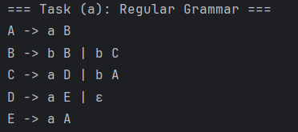
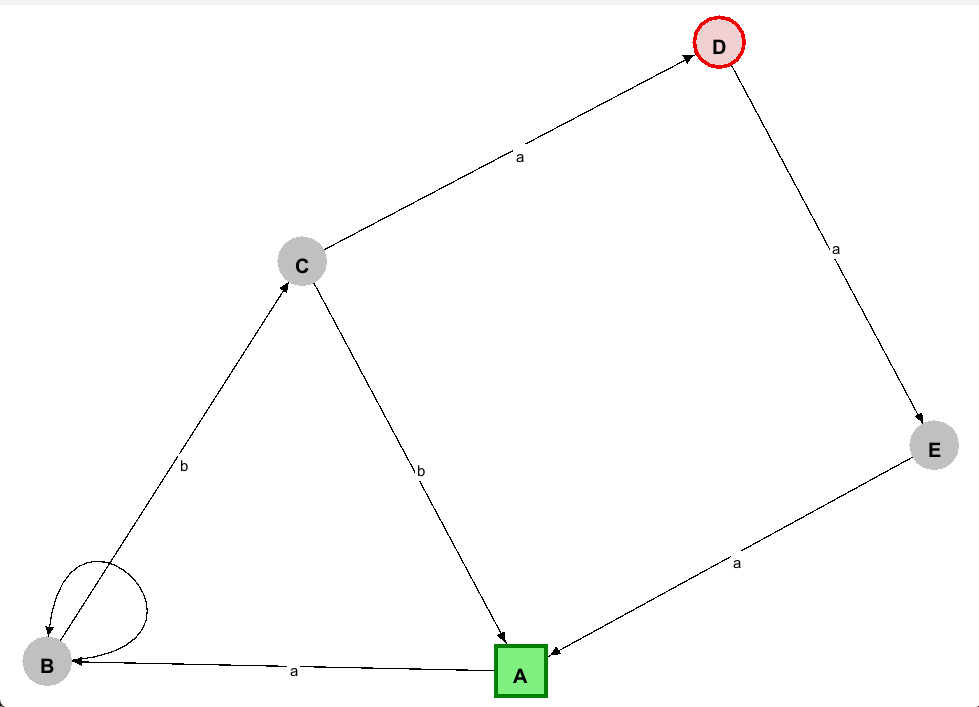
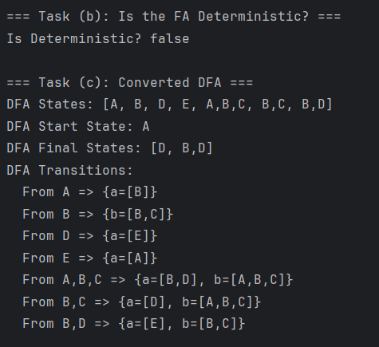
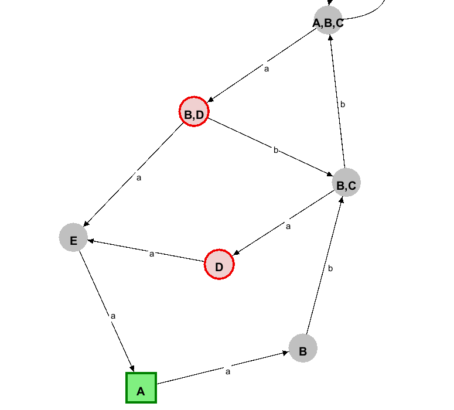

# **Lab Report**
**Name**: *Cobzari Ion*  
**Topic**: *Determinism in Finite Automata, Conversion from NDFA to DFA, Chomsky Hierarchy*

---
## Theory

**Finite automata** are abstract machines used to model computational processes, akin to state machines, with a finite number of states. Each automaton starts in a designated initial state and transitions between states based on input symbols, leading to a set of final or accepting states, signaling the completion of a process.

The key distinction between **deterministic finite automata (DFA)** and **nondeterministic finite automata (NDFA)** lies in their transition functions. In a DFA, each state has exactly one transition for each input symbol, ensuring a single predictable path for any given input. Conversely, an NDFA allows for multiple possible transitions for a given symbol, introducing non-determinism, where multiple paths could be taken, potentially leading to multiple possible outcomes.

Determinism in finite automata refers to the predictability of the system's behavior. DFAs, by their nature, are deterministic, as the automaton's state at any point is precisely determined by the input processed up to that point. NDFAs, with their multiple possible transitions for a single input, introduce a level of unpredictability or non-determinism.

The conversion from NDFA to DFA, also known as the **subset construction method**, involves creating DFA states that represent sets of NDFA states. This process ensures that the resulting DFA has no ambiguity in its transitions, thus converting a nondeterministic system into a deterministic one. This conversion can lead to an exponential increase in the number of states, potentially making the DFA much larger than the original NDFA.

The Chomsky hierarchy classifies formal grammars into four levels:

- **Type 0 (Recursively Enumerable)**: The least restricted grammars that can generate any language recognized by a Turing machine.
- **Type 1 (Context-Sensitive)**: Grammars where productions can expand a non-terminal only in a context.
- **Type 2 (Context-Free)**: Grammars that allow productions to replace a non-terminal with a string of terminals and non-terminals.
- **Type 3 (Regular)**: The most restricted grammars, which can be represented by finite automata and generate regular languages.

Regular languages, corresponding to Type 3 grammars in the Chomsky hierarchy, are of particular interest in the context of finite automata. Both DFAs and NDFAs can recognize these languages, making the study of automata integral to understanding the computational capabilities and limitations of regular languages.

## Objectives

1. Understand what an automaton is and what it can be used for.

2. Continuing the work in the same repository and the same project, the following need to be added:
   a. Provide a function in your grammar type/class that could classify the grammar based on Chomsky hierarchy.

   b. For this you can use the variant from the previous lab.

3. According to your variant number (by universal convention it is register ID), get the finite automaton definition and do the following tasks:

   a. Implement conversion of a finite automaton to a regular grammar.

   b. Determine whether your FA is deterministic or non-deterministic.

   c. Implement some functionality that would convert an NDFA to a DFA.

   d. Represent the finite automaton graphically (Optional, and can be considered as a **_bonus point_**):

   - You can use external libraries, tools or APIs to generate the figures/diagrams.
   - Your program needs to gather and send the data about the automaton and the lib/tool/API return the visual representation.

## **1. Chomsky Hierarchy Classification**

Below is a function that classifies a grammar into the Chomsky hierarchy, with added **inline comments** to clarify each step:
The `classifyChomskyHierarchy` function analyzes a set of grammar production rules and classifies the grammar into one of the four Chomsky hierarchy types. It assumes the grammar is initially regular, context-free, and context-sensitive, then iterates through each rule to check for constraints. If a rule violates the conditions for regularity, context-freeness, or context-sensitivity, the respective flag is set to false. The function then returns the most specific classification based on the constraints met.
```java
public String classifyChomskyHierarchy() {
   for (var entry : rules.entrySet()) {
      char lhs = entry.getKey(); // The left-hand side (LHS)
      for (String rhs : entry.getValue()) { // Each right-hand side (RHS)
         // If the RHS is empty, the grammar can generate empty => Type-0
         if (rhs.isEmpty()) return "Type-0 (Unrestricted)";
         // If RHS is longer than LHS, it might not be strictly regular
         if (rhs.length() > lhs) isRegular = false;
         // The LHS must be a valid non-terminal
         if (!nonTerminals.contains(lhs)) return "Invalid Grammar";
         // For context-sensitive grammars, check if |LHS| <= |RHS|
         if (rhs.length() < lhs) isContextSensitive = false;
         boolean isRightLinear = rhs.matches(".*[A-Z]$");
         boolean isLeftLinear = rhs.matches("^[A-Z].*");
        if (rhs.chars().anyMatch(ch -> nonTerminals.contains((char) ch)) && (!isRightLinear && !isLeftLinear)) {
            isRegular = false;
         }
         if (rhs.length() > 1 && rhs.chars().anyMatch(ch -> nonTerminals.contains((char) ch))) {
            isContextFree = false;}}}
   return isRegular
           ? "Type-3 (Regular)"
           : isContextFree
           ? "Type-2 (Context-Free)"
           : isContextSensitive
           ? "Type-1 (Context-Sensitive)"
           : "Type-0 (Unrestricted)";
}
```

### **Key Points**
- **Type-3**: The grammar is right-linear or left-linear.
- **Type-2**: There is a single non-terminal on the LHS.
- **Type-1**: Follows `|LHS| ≤ |RHS|`, with further constraints.
- **Type-0**: No specific restrictions.

---

## **2. Finite Automaton to Regular Grammar**

Below is how to convert an FA into a regular grammar, with **inline comments** on essential steps:
The convertToRegularGrammar function converts a finite automaton (FA) into a regular grammar. It maps FA states to non-terminals and transitions to production rules. Each transition (state, input) → nextState becomes a grammar rule state → input nextState. For final states, it adds an epsilon (ε) production to indicate acceptance
```java
public static Map<Character, List<String>> convertToRegularGrammar(FiniteAutomaton fa) {
   // Initialize the grammar map, where each FA state is a non-terminal
   Map<Character, List<String>> grammar = new HashMap<>();
   fa.states.forEach(state -> grammar.put(state, new ArrayList<>()));

   // For each state, examine its transitions and form productions
   fa.transitions.forEach((state, trans) ->
           trans.forEach((input, nextStates) ->
                   nextStates.forEach(next -> grammar.get(state).add(input + " " + next))
           )
   );

   // For final states, add epsilon (ε) productions to signify acceptance
   fa.finalStates.forEach(finalState -> grammar.get(finalState).add("ε"));

   return grammar;
}
```

### **Key Points**
- **States → Non-Terminals**: Each state in the FA is treated as a non-terminal symbol.
- **Alphabet → Terminals**: FA input symbols become the grammar terminals.
- **Transitions → Rules**: A transition `(state, symbol) -> nextState` becomes `state -> symbol nextState`.
- **Final States**: Insert an ε-production to allow termination in the grammar.

---

## **3. Checking If an FA Is Deterministic**

This snippet determines if the finite automaton is a DFA (only one next state per symbol) or an NFA:
The `isDeterministic` function verifies whether a given finite automaton (FA) adheres to deterministic behavior. In a deterministic finite automaton (DFA), each state must have exactly one transition for every possible input symbol.

This function iterates through all the transitions in the automaton, ensuring that no input symbol maps to multiple possible next states. If any transition for a given symbol leads to more than one next state, the function determines that the FA is nondeterministic.

By using Java streams, the function efficiently checks all transition mappings and returns `true` if the FA is deterministic, otherwise `false`. This ensures a quick assessment of whether the given FA conforms to the strict rules of a DFA or exhibits nondeterministic behavior.
```java
public static boolean isDeterministic(FiniteAutomaton fa) {
   // If any transition on a single symbol leads to multiple states, it's nondeterministic
   return fa.transitions.values().stream()
           .allMatch(trans -> trans.values().stream().allMatch(next -> next.size() == 1));
}
```

### **Key Points**
- **Exactly One Next State**: Determinism means every `(state, symbol)` has one and only one next state.
- **Multiple Next States**: If found, it indicates nondeterminism.

---

## **4. Converting NDFA to DFA** *(Subset Construction)*

The `convertToDFA` function transforms a nondeterministic finite automaton (NDFA) into a deterministic finite automaton (DFA) using the **subset construction method**. It systematically replaces sets of NDFA states with single DFA states, ensuring deterministic behavior.

The function processes the NDFA states iteratively:
1. **Iterate through each subset of states**: The function dequeues a set of NDFA states and examines possible transitions.
2. **Determine next states**: For each input symbol, the function calculates the set of reachable states, including ε-closures.
3. **Track new states**: If a newly formed state subset has not been encountered before, it is added to the DFA's state set and queued for processing.
4. **Store transitions**: The DFA transitions are recorded as each subset is processed.

Once all possible subsets have been explored and recorded, the function builds and returns a DFA that accurately represents the language of the original NDFA but in a deterministic manner.
```java
public static FiniteAutomatonStringVersion convertToDFA(FiniteAutomaton ndfa) {
    while (!queue.isEmpty()) {
      Set<Character> currentSubset = queue.poll();
      // For each input symbol, gather all possible next states
      for (char input : ndfa.alphabet) {
         Set<Character> nextSubset = epsilonClosure(ndfa, getNextStates(ndfa, currentSubset, input));
        if (!nextSubset.isEmpty() && dfaStates.add(nextSubset)) {
            queue.add(nextSubset);
         }
         dfaTransitions.computeIfAbsent(currentSubset, k -> new HashMap<>())
                 .put(input, nextSubset);
      }
   }
  return buildDFA(ndfa, dfaStates, dfaTransitions, startSubset);
}
```

### **Key Points**
- **Subset Construction**: Each DFA state corresponds to a set of NFA states.
- **Epsilon Closure**: Ensures we account for ε-moves from any state.
- **BFS**: Systematically explores all reachable subsets.
- **Result**: A deterministic FA covering all possible behaviors of the original NFA.

---

## **5. Graphical Representation of FA** *(Optional / Bonus)*

The `visualizeAutomaton` function generates a graphical representation of a finite automaton using **GraphStream**. It adds each state as a node in the graph and labels it accordingly. Then, it processes the transitions, adding directed edges between states and labeling them with the corresponding input symbols. Finally, the function displays the constructed graph visually. This approach provides an intuitive way to understand the structure and behavior of a finite automaton.
```java
public static void visualizeAutomaton(FiniteAutomaton fa, String title) {
fa.states.forEach(state ->
           graph.addNode(String.valueOf(state)).setAttribute("ui.label", state)
   );
fa.transitions.forEach((from, trans) ->
           trans.forEach((input, nextStates) ->
                   nextStates.forEach(to ->
                           graph.addEdge(from + "-" + input + "-" + to,
                                           String.valueOf(from),
                                           String.valueOf(to), true)
                                   .setAttribute("ui.label", input))));
}
```

### **Key Points**
- **Graph Nodes**: Each state is a node; you can style final/start states differently.
- **Graph Edges**: Each labeled edge indicates a transition on a given symbol.
- **Optional**: This step is a bonus but greatly helps visualize automata.

---

## **6. Results & Conclusion**

1. **Chomsky Hierarchy**: We implemented a method that categorizes grammars into Types 0–3 by analyzing production rules.
2. **FA → Regular Grammar**: States become non-terminals, transitions become production rules, and final states yield ε-productions.
3. **Determinism Check**: A quick function ensures each symbol in a state leads to exactly one successor.
4. **NFA → DFA**: Implemented the subset construction to systematically remove nondeterminism.
5. **Visualization**: Graphical tools (like GraphStream) can illustrate states and transitions for clarity.

**Overall, these steps confirm the underlying theory that regular languages can be expressed in multiple forms: (1) as regular grammars and (2) via deterministic finite automata. Converting from an NFA to a DFA guarantees a deterministic representation, showcasing that nondeterminism does not add expressive power to regular languages. This solidifies the foundational principle in formal language theory that DFAs, NFAs, and regular grammars are equally powerful in describing regular languages.**

### **Screenshots:**
- 
- 
- 
- 
